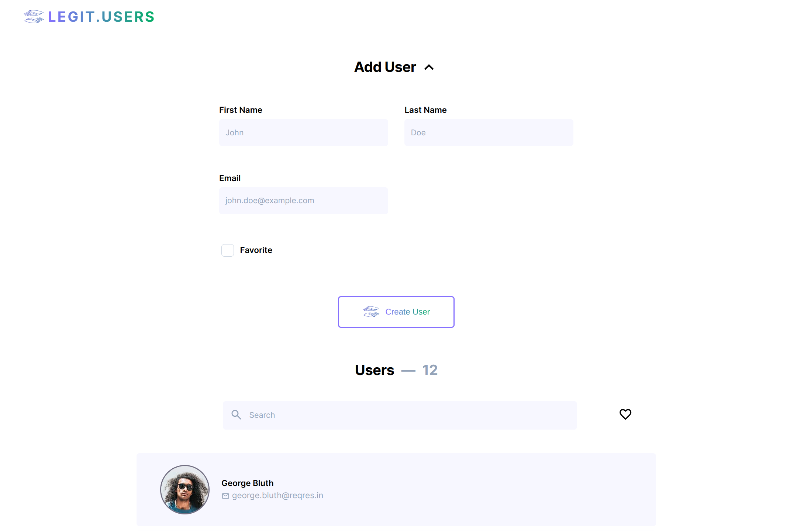

# Legit Users

User list with React & TypeScript.

## Demo

<p align="center">
  
</p>
<h2 align="center">
  <a href="https://legitusers.netlify.app">👉 Demo</a>
</h2>

## About

The app fetches mock users from [reqres.in](https://reqres.in/) and displays them on a paginated list with several editing options.

## Features

- User List Page
- User Details Page
- User Creation Form
- Form input feedback and submission message
- Form can be expanded or collapsed
- Form simulates a `POST` request to reqres.in with the entered users
- Pagination
- For added users, a random profile picture is fetched from [randomuser.me](https://randomuser.me/)
- Favorite users by clicking on the heart icon when hovering on them
- Filter users by search or favorites
- Search looks for first name, last name or both. It is cases, symbols and spaces insensitive
- Filters can be combined, i.e. you can perform a search query on favorited users
- Responsive

## Additional Feature Reasoning

- **Search query:** Having the ability to search for a user using text is very convenient and a fast way to find the user you are looking for, especially if the list grows bigger

- **Favorite:** Being able to favorite users is a handy way to save users you are interested in for easy retrieval later on or highlighting

- **Expandable form:** As adding users might not be the main reason users use the app, it made sense to give the possibility to hide it so users can focus on the user list if desired

- **Random Profile Picture for added users:** When adding users without a picture, it feels like something's wrong and breaks the visual consistency, having a picture makes the UI look better. Of course, the added pictures are random, so the gender might not correspond with a name, so there's room for improvement in this feature

## Tech Stack

- **UI Library:** React
- **Languages:** TypeScript, SCSS, HTML
- **Build Tool:** Vite
- **Deployment:** Netlify
- **Dependencies:**
  - react-router-dom: Routing
  - react-query: Data fetching
  - react-paginate: User list pagination
  - react-hook-form: User form
  - MUI: Tooltip

## Run Locally

Clone the project

```bash
git clone git@github.com:amadeuio/legit.users.git
```

Go to the project directory

```bash
cd legit.users
```

Install dependencies

```bash
npm install
```

Start the server

```bash
npm run dev
```

## Acknowledgements

- Design inspo: [Legit.Health](https://legit.health/)
- [reqres.in](https://reqres.in/)
- [randomuser.me](https://randomuser.me/)
- [Google Icons](https://fonts.google.com/icons)
- [ChatGPT](https://chat.openai.com)

Shoutout to my code companions: Coffee & [Cozy Fireplace](https://www.youtube.com/watch?v=ze-TjhwceFE)

## License

[MIT](https://choosealicense.com/licenses/mit/)
